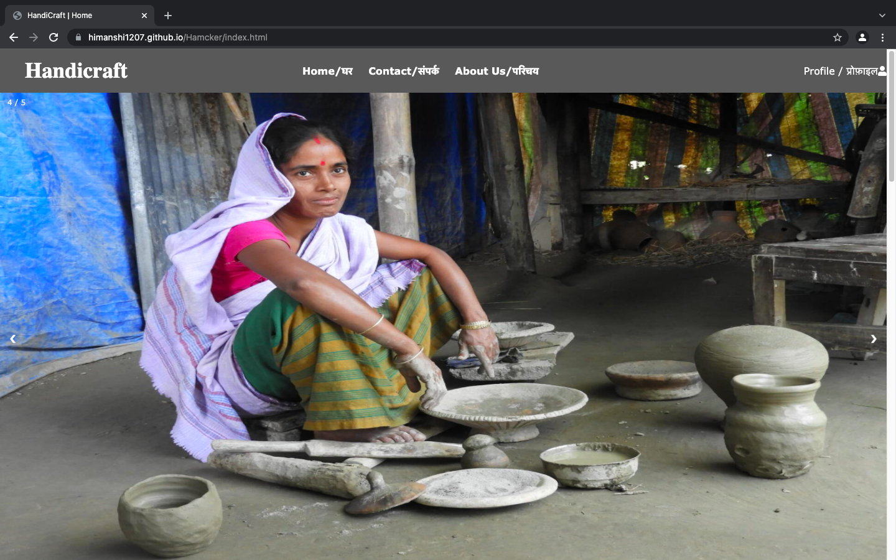
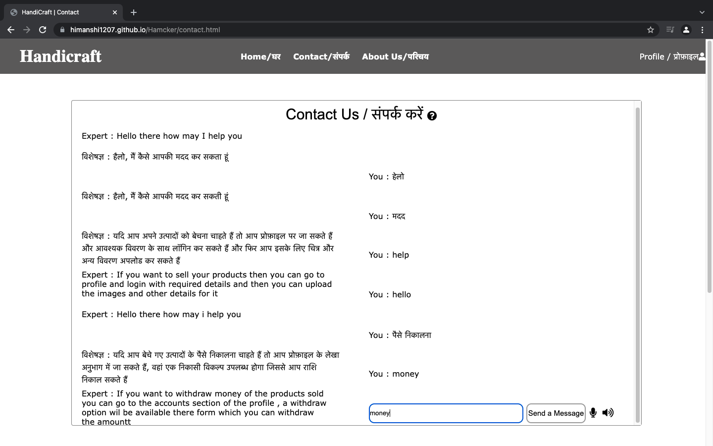
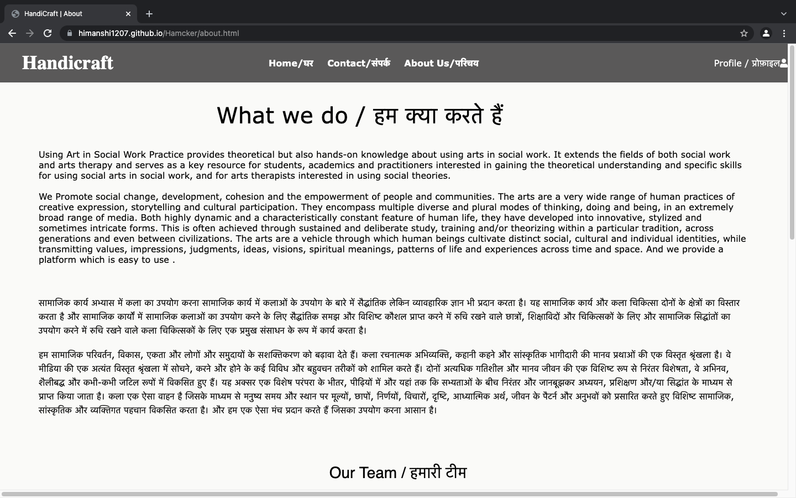
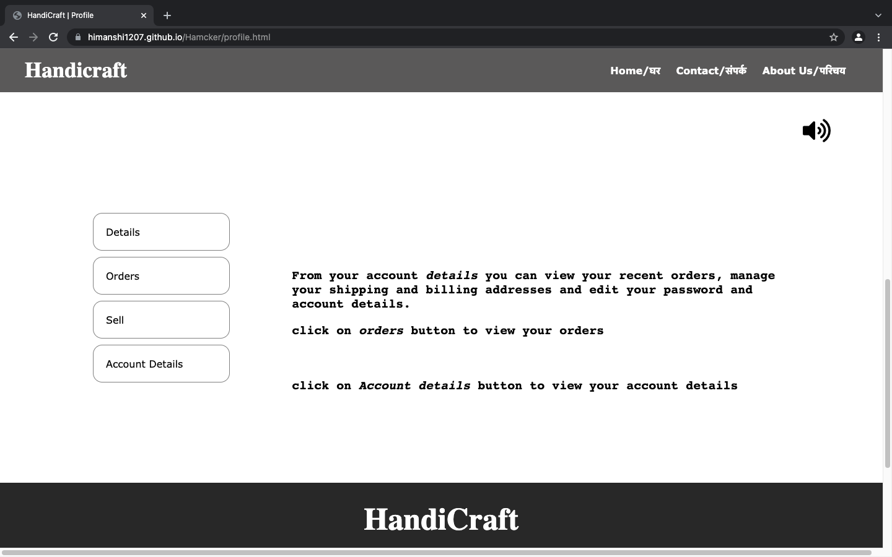

# Team Name : Hamcker

# Introduction

AS the village women have very less knowledge of technology  so we tried to keep the interface simple to understand
and we also used hindi language for their better understanding to deal with language barrier.

# Description

On home page we displayed the art pieces with theri price tag which are already uploaded and can be bought by buyers.
  

In **Contact page** we used a voice and text chatbot to deal effectively with language barrier so that the villagers can directly ask their questions like how to upload their products and withdraw money etc. The villagers has to provide their adhaar number while filling form for identification and approval to register as artist on the website.
  

And **About Us** page contains information about taem members who took this social initiative.
  

Finally, the **Profile** page contains the information relatd to user and the forms required to be filled by different users (sellers/buyers) on website and can display their details , previous orders ,Accout details and **sell** part where the artist(village women) can upload the pictures of their products and then it will also be displayed their after the upload.
  

© 2021 HandiCraft

